# 1. Spring Framework Course Overview.

### Web related terms such as Html,Css,Js bootstraps etc.

# 2. What is Spring Framework | Dependency Injection | Inversion of Control | Spring Core Module

- Kal Geeta ke jagah yadi bablu ka object ki requirement hue Ram ko
    - So pure code mein jaha jaha Geeta ka object hai wo replace karna honga bablu ke object se.
- So basically every time we have to change code and compile it again.

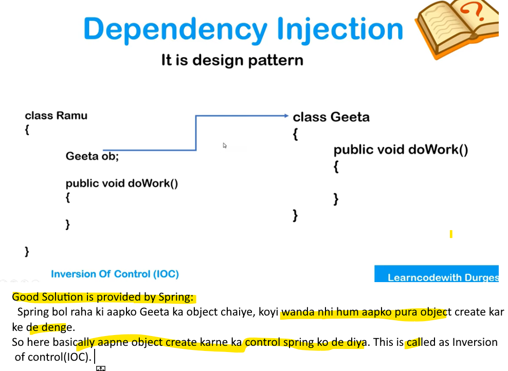
- kal yadi Geeta ka jaagah bablu ka object chaiye ramu ko
    - to Spring uska bhi object create karke de denga.
    - isme aapko code ko bar bar compile nhi karna padenga.


# 3. Overview of Spring Framework module.

### Spring Core:
- Consist of 4 module namely Core, beans, context,spel.
- Core & beans provide basic thing like dependency injection and IOC.
    - iske wajah se hi hum dependency inject kar sakte 
    - constructor/ setter injection all stuff.
- Context provide event propagation,resource loading, transperent creation of context, internationalization.
- Spel  abbreviate as expression language 
    - With this we can query or manipulate object graph at runtime.
### AOP
- Consist of 3 module namely Aspect, Instrumentation and messaging.
- Aspect provide method interceptors(method ke pehle ya baadme koyi kaam karna ho) & pointcuts(jisse hum code ko decouple kar pave.)
- messaging aap baanane ke liye use hota hai.
### Data Integration layer.
- Object Realtional Mapping
- Object Xml mapping.
- Orm ye ek integration layer provide karta hai.
    - yadi aapko hibernate apne application mein use karna raha so ye layer se possible ho jata.
### Web module
- web oriented feature provide karta.
### Test module
- Unit testing like JUNIT and mokito.
# 4. Spring IOC container.

- Spring ke sath hume ek component/container milta hai, jise hum Spring IOC  container kehte hai.
- It is responsible for.
    - Basically ye object ko create karta.
    - hold that object in memory
    - whenever require ye inject karta dependency.
- Basically it manage the life cyle object.
#### So spring container is a predefined program which manage the life cyle of object.

# 5. Ways of Injecting dependency.

- As per above dig, Student class depend hai Address class ke object ke upar
- So IOC container sabse pehele Address class ki sari value set/intitialize  karke uska object create Karenga.
- Phir Student class ka object create karte hue, uski  id aur name initialize karenge and Address class ki object inject Karenga Student class attribute address mein.
- is tarah se student class ka bean i.e object create honga. Jise hum use kar sakte hai.


- For Setter Injection
    - aapko apne class mein Setter methods define karni hongi.
- Object create karte waqt container call karenga setter methods.
    - Address class ka object create karte waqt container uski setter method call karke sari value initialize kar lenga.
- Similarly Student object create karte waqt IOC container call karenga setter method but jab setAddreess() method call karenga so waha IOC container Address class ki dependency inject kar denga.


- Constructor injection ke liye aapko class mein constructor likhna  honga.
- Object create  karte waqt IOC Conatiner constructor call karenga instead of setter method.
    

# 6. Practical

### 1) Create a maven project

### 2) Adding dependencies
##### spring core and context we require.

##### If you encounter with error then update the project

- Right Clk -> maven -> update project
##### U can also update java 

### 3) Creating beans

- create fileds with Constructor default + parameterized then Getter & setters then toString() method.
### 4) Creating configuration file & 5) Setter Injection
###### Create xml file - New then other

- Add dtd beans,context and p schema.

##### Pom.xml
```xml
<project xmlns="http://maven.apache.org/POM/4.0.0"
	xmlns:xsi="http://www.w3.org/2001/XMLSchema-instance"
	xsi:schemaLocation="http://maven.apache.org/POM/4.0.0 http://maven.apache.org/xsd/maven-4.0.0.xsd">
	<modelVersion>4.0.0</modelVersion>

	<groupId>com.adi.springcore</groupId>
	<artifactId>springcore</artifactId>
	<version>0.0.1-SNAPSHOT</version>
	<packaging>jar</packaging>

	<name>springcore</name>
	<url>http://maven.apache.org</url>

	<properties>
		<project.build.sourceEncoding>UTF-8</project.build.sourceEncoding>
	</properties>

	<dependencies>

		<!-- https://mvnrepository.com/artifact/org.springframework/spring-core -->
		<dependency>
			<groupId>org.springframework</groupId>
			<artifactId>spring-core</artifactId>
			<version>6.1.0</version>
		</dependency>

		<!--
		https://mvnrepository.com/artifact/org.springframework/spring-context -->
		<dependency>
			<groupId>org.springframework</groupId>
			<artifactId>spring-context</artifactId>
			<version>6.1.0</version>
		</dependency>

		<dependency>
			<groupId>junit</groupId>
			<artifactId>junit</artifactId>
			<version>3.8.1</version>
			<scope>test</scope>
		</dependency>
	</dependencies>
</project>
```
##### Student Pojo
```java
package com.adi.springcore;

public class Student {

	private String studentId;
	private String studentName;
	private String studentAddress;

	public Student() {
		super();
		// TODO Auto-generated constructor stub
	}

	public Student(String studentId, String studentName, String studentAddress) {
		super();
		this.studentId = studentId;
		this.studentName = studentName;
		this.studentAddress = studentAddress;
	}

	public String getStudentId() {
		return studentId;
	}

	public void setStudentId(String studentId) {
		System.out.println("Setter injection is getting called for id");
		this.studentId = studentId;
	}

	public String getStudentName() {
		return studentName;
	}

	public void setStudentName(String studentName) {
		System.out.println("Setter injection is getting called for name" );
		this.studentName = studentName;
	}

	public String getStudentAddress() {		
		return studentAddress;
	}

	public void setStudentAddress(String studentAddress) {
		System.out.println("Setter injection is getting called for address");
		this.studentAddress = studentAddress;
	}

	@Override
	public String toString() {
		return "Student [studentId=" + studentId + ", studentName=" + studentName + ", studentAddress=" + studentAddress
				+ "]";
	}

}
```
##### config.xml
```xml
<?xml version="1.0" encoding="UTF-8"?>     
   <beans xmlns="http://www.springframework.org/schema/beans"     
   xmlns:xsi="http://www.w3.org/2001/XMLSchema-instance" 
   xmlns:context="http://www.springframework.org/schema/context"
   xmlns:p="http://www.springframework.org/schema/p" 
   xsi:schemaLocation="http://www.springframework.org/schema/beans 
   http://www.springframework.org/schema/beans/spring-beans.xsd
    http://www.springframework.org/schema/context 
   http://www.springframework.org/schema/context/spring-context.xsd
   ">
     
     <!-- This is our bean 
      		here we add dtd of bean, context and pschema
      -->
     <bean class="com.adi.springcore.Student"  name="student1">
     	<property name="studentId">
     		<value>12334</value>
     	</property>
     	     	
     	<property name="studentName">
     		<value>Aditya Rathor</value>
     	</property>
     	     	
     	<property name="studentAddress">
     		<value>Nagpur</value>
     	</property>
     </bean>
     
 </beans>
```
### 6) Main class
##### App.java
```java
package com.adi.springcore;

import org.springframework.context.ApplicationContext;
import org.springframework.context.support.ClassPathXmlApplicationContext;

/**
 * Hello world!
 *
 */
public class App 
{
    public static void main( String[] args )
    {
    	System.out.println("Hello_world");
        ApplicationContext context = new ClassPathXmlApplicationContext("com/adi/springcore/config.xml");
        Student  student = (Student) context.getBean("student1");
        System.out.println(student);
    }
}
```
#### Ab yadi hume change karna hai name toh humko code compile karne ki jarurat nhi .. sirf config file mein change karo and run it kafi hai.

# 7. Property injection using p schema and using value as an attribute.
### IN previous video we inject property via Value as Tag/element.

###  Inject Property via Value as an Attribute

### If you want to create another object then create another bean

### Inejct Property via Value as an P Schema

# 8. How to inject collection types i.e List,Set,Map and Properties.
- In previous video we see, how ***primitive  data type** will be injected by setter or property injection
    - via Value as an element/tag
    - via value as an attribute
    - via value as p schema.


### How Collection data type will be inject by setter or property injection
#### For List
- List can contain duplicate element
- we use List tag for inserting vlaue in list
- for null we simply write null tag.


#### For Set
- Set does not allow duplicate element
- we use set tag for inserting value in Set

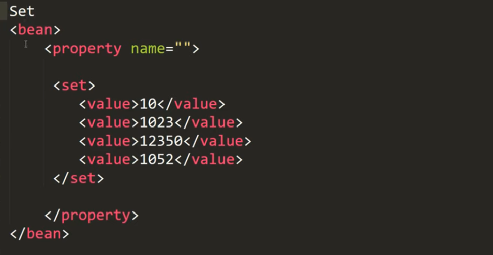
#### For Map
- We use Map tag for inserting value in Map
- Map is nothing but group of entries
- Inside entry we have key-value pair.


#### For Properties
- We use props tag for inserting value in Properties
- Inside Props tag we use prop tag to specify key
- And we specify value in body part


# 9. Practical
### Create a separate package and write your code there.
#### Emp.java
```java
package com.springcore.collections;

import java.util.List;
import java.util.Map;
import java.util.Set;

public class Emp {

	private String name;
	// Employee having multiple phone numbers
	private List<String> phones;
	// Employee have multiple address
	private Set<String> address;
	// Employee doing multiple courses having certain duration/price
	private Map<String, String> courses;

	public Emp(String name, List<String> phones, Set<String> address, Map<String, String> courses) {
		super();
		this.name = name;
		this.phones = phones;
		this.address = address;
		this.courses = courses;
	}

	public Emp() {
		super();
	}

	public String getName() {
		return name;
	}

	public void setName(String name) {
		this.name = name;
	}

	public List<String> getPhones() {
		return phones;
	}

	public void setPhones(List<String> phones) {
		this.phones = phones;
	}

	public Set<String> getAddress() {
		return address;
	}

	public void setAddress(Set<String> address) {
		this.address = address;
	}

	public Map<String, String> getCourses() {
		return courses;
	}

	public void setCourses(Map<String, String> courses) {
		this.courses = courses;
	}

	@Override
	public String toString() {
		return "Emp [name=" + name + ", phones=" + phones + ", address=" + address + ", courses=" + courses + "]";
	}

	
}
```
#### configuration file
```xml
<?xml version="1.0" encoding="UTF-8"?>
<beans xmlns="http://www.springframework.org/schema/beans"
	xmlns:xsi="http://www.w3.org/2001/XMLSchema-instance"
	xmlns:context="http://www.springframework.org/schema/context"
	xmlns:p="http://www.springframework.org/schema/p"
	xsi:schemaLocation="http://www.springframework.org/schema/beans 
   http://www.springframework.org/schema/beans/spring-beans.xsd
    http://www.springframework.org/schema/context 
   http://www.springframework.org/schema/context/spring-context.xsd
   ">
   
	<bean class="com.springcore.collections.Emp" name="employee" >	
		<property name="name" value="Radhe" />
		
		<property name="phones">
			<list>
				<value>34343435</value>
				<value>121334</value>
				<null></null>
			</list>
		</property>
		
		<property name="address">
			<set>
				<value>Delhi</value>
				<value>Nagpur</value>
				<value>Ayodhya</value>
			</set>
		</property>
		
		<property name="courses">
			<map>
				<entry key="java" value="2months" />
				<entry key="Sql" value="1 months" />
			</map>
		</property>		
		
		
	</bean>
</beans>
```
#### Main app
```java
package com.springcore.collections;

import org.springframework.context.ApplicationContext;
import org.springframework.context.support.ClassPathXmlApplicationContext;

public class TestCollecitonInjection {

	public static void main(String[] args) {
		
		ApplicationContext context = new ClassPathXmlApplicationContext("com/springcore/collections/configCollection.xml");

		
		Emp emp1 = (Emp) context.getBean("employee");
		
		System.out.println(emp1);
		System.out.println("-------------");
		System.out.println("Name is :          "+ emp1.getName());
		System.out.println("List of phones : "+emp1.getPhones());
		System.out.println("Set of address : "+emp1.getAddress());
		System.out.println("Map of courses : "+emp1.getCourses());
	}

}
```
#### Output
```
Emp [name=Radhe, phones=[34343435, 121334, null], address=[Delhi, Nagpur, Ayodhya], courses={java=2months, Sql=1 months}]
-------------
Name is :          Radhe
List of phones : [34343435, 121334, null]
Set of address : [Delhi, Nagpur, Ayodhya]
Map of courses : {java=2months, Sql=1 months}
```
### Some modification 
#### If your list contain only 1 value, then you need not to provide explicitly list tag

#### If you require blank list

# 10. Injecting Refrence type 

### Injecting Ref as an element
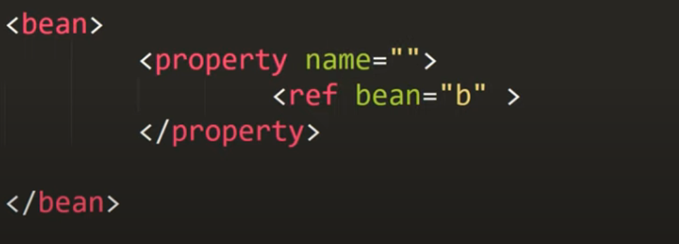
### A.java
```java
package com.springcore.ref;

public class A {

	private int x;

	private B ob;

	public A() {
		super();
		// TODO Auto-generated constructor stub
	}

	public int getX() {
		return x;
	}

	public void setX(int x) {
		this.x = x;
	}

	public B getOb() {
		return ob;
	}

	public void setOb(B ob) {
		this.ob = ob;
	}

	@Override
	public String toString() {
		return "A [x=" + x + ", ob=" + ob + "]";
	}

}
```
### B.java
```java
package com.springcore.ref;

public class B {

	private int y;

	public B() {
		super();
		// TODO Auto-generated constructor stub
	}

	public int getY() {
		return y;
	}

	public void setY(int y) {
		this.y = y;
	}

	@Override
	public String toString() {
		return "B [y=" + y + "]";
	}

}
```
### configuration file
```xml
<?xml version="1.0" encoding="UTF-8"?>     
   <beans xmlns="http://www.springframework.org/schema/beans"     
   xmlns:xsi="http://www.w3.org/2001/XMLSchema-instance" 
   xmlns:context="http://www.springframework.org/schema/context"
   xmlns:p="http://www.springframework.org/schema/p" 
   xsi:schemaLocation="http://www.springframework.org/schema/beans 
   http://www.springframework.org/schema/beans/spring-beans.xsd
    http://www.springframework.org/schema/context 
   http://www.springframework.org/schema/context/spring-context.xsd
   ">
	
	<bean class="com.springcore.ref.B" name="bref" p:y="12" />	
	
	<bean class="com.springcore.ref.A" name="aref">
		<property name="x" value="20"/>
		<property name="ob">
			<ref bean="bref"/>
		</property>
	</bean>  
     
 </beans>
```
### main class
```java
package com.springcore.ref;

import org.springframework.context.ApplicationContext;
import org.springframework.context.support.ClassPathXmlApplicationContext;

public class TestRef {

	public static void main(String[] args) {

		ApplicationContext context = new 
				ClassPathXmlApplicationContext("com/springcore/ref/configRef.xml");

		A temp = (A) context.getBean("aref");

		System.out.println(temp);
		System.out.println("============");
		System.out.println("x value is : "+ temp.getX());
		System.out.println("y value is : "+ temp.getOb().getY());
	}

}
```
### Output
```
A [x=20, ob=B [y=12]]
============
x value is : 20
y value is : 12
```
### In previous example we use refrecne as an element
### Now we use Refrence as an attribute

### You can use Refrence via pschema

# 11. Constructor Injection
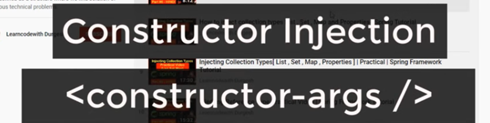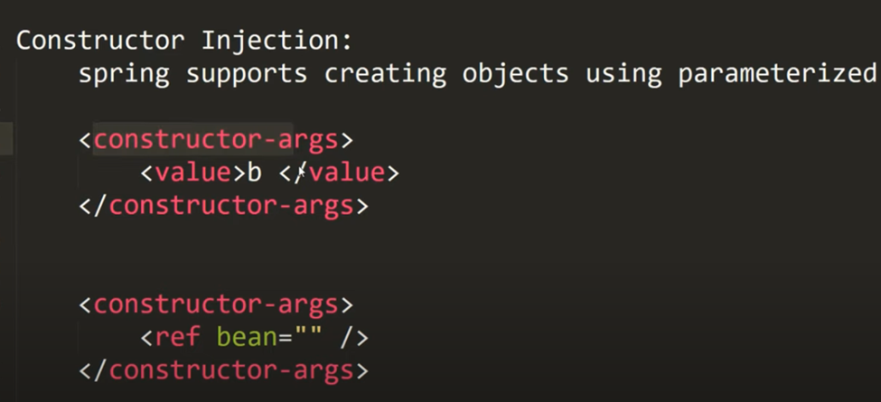
### Person.java
```java
package com.adi.springcore.constInject;

public class Person {

	private String name;
	private int personId;

	// yaha hum spring ki sahyata se
	// constructor ke through value inject karni hai
  // so for that constructor required.
	
	public Person(String name, int personId) {
		this.name = name;
		this.personId = personId;
	}

	@Override
	public String toString() {
		return  this.name + " : "+ this.personId;
	}
}
```
### configuration
```xml
<?xml version="1.0" encoding="UTF-8"?>     
   <beans xmlns="http://www.springframework.org/schema/beans"     
   xmlns:xsi="http://www.w3.org/2001/XMLSchema-instance" 
   xmlns:context="http://www.springframework.org/schema/context"
   xmlns:p="http://www.springframework.org/schema/p" 
   xsi:schemaLocation="http://www.springframework.org/schema/beans 
   http://www.springframework.org/schema/beans/spring-beans.xsd
    http://www.springframework.org/schema/context 
   http://www.springframework.org/schema/context/spring-context.xsd
   ">
     
     <!-- U can also use cSchema like pschema
     	cSchema is used for injecting value in constructor
     	 For each paramerter 1 constructor-arg is required
     	-->
     
  	<bean class="com.adi.springcore.constInject.Person" name="person">
  	
  	<!-- Here we use value as tag in constructor -->
  		<constructor-arg>
  			<value>Aditya</value>
  		</constructor-arg>
  		
  		<!-- Value as an attribute 
  	by default constructor-arg ye stirng type ke value leta
  		u can also explicityly specify ki iska type kya hai -->
  		<constructor-arg value="21"  type="int"/>
  	</bean>
  	
  	<!-- 
  		1) Ye upar ki bean Person class ke wo constructor ko call karengi
  			jiska 1st arg is String and 2nd is int
  	 -->
     
 </beans>
```
### Main class
```java
package com.adi.springcore.constInject;

import org.springframework.context.ApplicationContext;
import org.springframework.context.support.ClassPathXmlApplicationContext;

public class TestCi {

	public static void main(String[] args) {

		ApplicationContext context = new 
			ClassPathXmlApplicationContext("com/adi/springcore/constInject/ciConfig.xml");
		
		Person p =(Person) context.getBean("person");
		
		System.out.println(p);

	}

}
```
### Ouptut
```
Aditya : 21
```
### Ab yadi hum configuration file se type="int" nikal de tab output kya aavenga
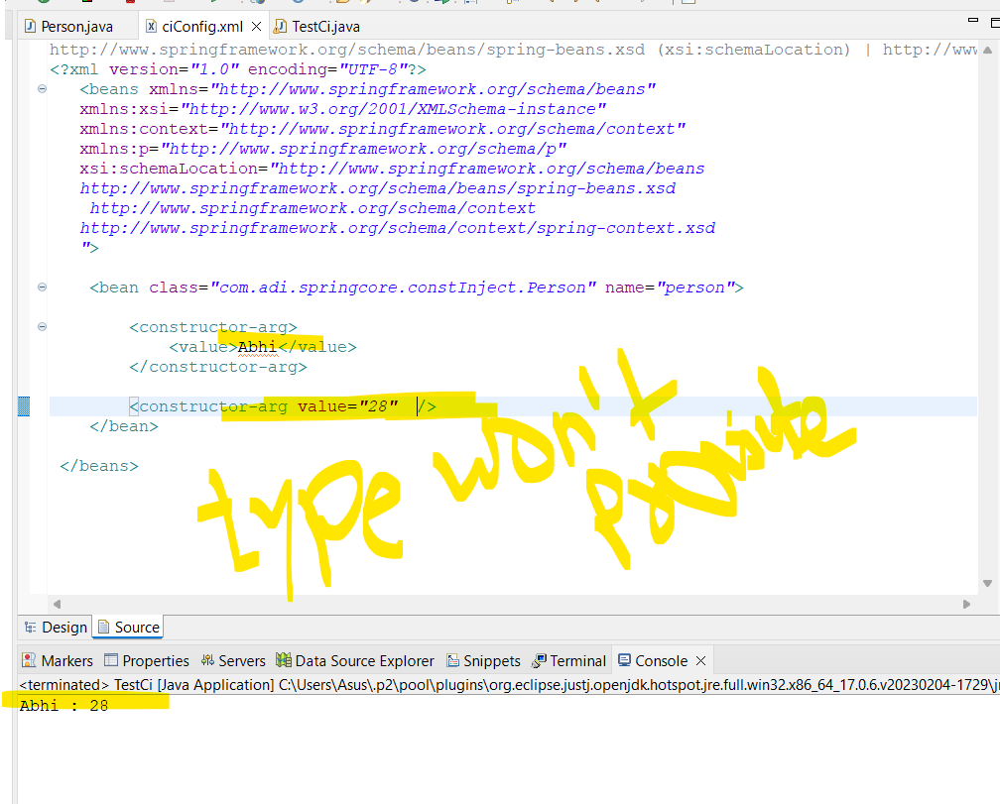
- abhi bhi proper output aa raha hai;
- kyuki yaha sirf ek hi constructor hai and i.e Person(String,int)
    - so Spring yaha intelligency dikhate hue
    - ye wala hi constructor call kar raha hai
    - That's why output comes
- Yadi Person class mein 2 parametrized constructor hote i.e Person(Sting,int) and Person(String,String)
    - tab spring intelligency nhi dikha pata
    - aur Persono(String,String) wala constructor call karta
- This above problem is called amibguity problem
- To resolve ambiguity problem always specify type keyword in constructor-arg.
### Check out refrence type parameter
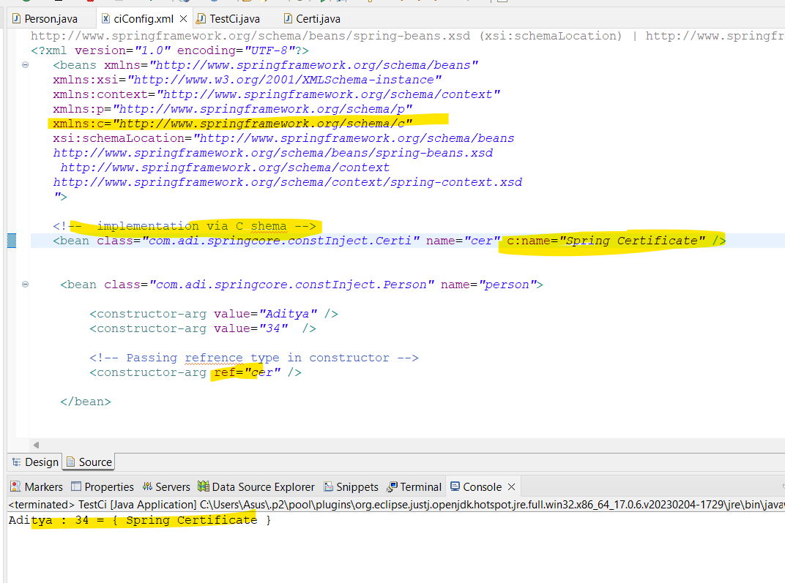
### Certi.java
```java
package com.adi.springcore.constInject;

public class Certi {

	 String name;

	public Certi(String name) {
		super();
		this.name = name;
	}

	@Override
	public String toString() {
		return this.name;
	}

}
```
### Person.java
```java
package com.adi.springcore.constInject;

public class Person {

	private String name;
	private int personId;
	private Certi certi;

	public Person(String name, int personId,Certi certi) {
		this.name = name;
		this.personId = personId;
		this.certi = certi;
	}

	@Override
	public String toString() {
		return  this.name + " : "+ this.personId + " = { "+this.certi.name+" }";
	}
}
```
### configuration file
```xml
<?xml version="1.0" encoding="UTF-8"?>     
   <beans xmlns="http://www.springframework.org/schema/beans"     
   xmlns:xsi="http://www.w3.org/2001/XMLSchema-instance" 
   xmlns:context="http://www.springframework.org/schema/context"
   xmlns:p="http://www.springframework.org/schema/p" 
   xmlns:c="http://www.springframework.org/schema/c" 
   xsi:schemaLocation="http://www.springframework.org/schema/beans 
   http://www.springframework.org/schema/beans/spring-beans.xsd
    http://www.springframework.org/schema/context 
   http://www.springframework.org/schema/context/spring-context.xsd
   ">
   
   <!--  implementation via C shema -->
   <bean class="com.adi.springcore.constInject.Certi" name="cer" c:name="Spring Certificate" />
   	
  
  	<bean class="com.adi.springcore.constInject.Person" name="person">
  	
  		<constructor-arg value="Aditya" />  
  		<constructor-arg value="34"  />
  		
  		<!-- Passing refrence type in constructor -->
  		<constructor-arg ref="cer" />
  		
  	</bean>

	
 </beans>
```
### main class
```java
package com.adi.springcore.constInject;

import org.springframework.context.ApplicationContext;
import org.springframework.context.support.ClassPathXmlApplicationContext;

public class TestCi {

	public static void main(String[] args) {

		ApplicationContext context = 
				new ClassPathXmlApplicationContext("com/adi/springcore/constInject/ciConfig.xml");

		Person p = (Person) context.getBean("person");

		System.out.println(p);

	}

}
Output:
Aditya : 34 = { Spring Certificate }
```
# 12. Ambiguity problem and its solution via CI
### Create Addition class
```java
package com.adi.springcore.constInject.ambiguity;

public class Addition {

	private int a;
	private int b;
	
    //costructor 1st as int, int
	public Addition(int a,int b) {
		this.a=a;
		this.b=b;
		System.out.println("Constructor : int , int");
	}
	
    //const 2nd as double,double
	public Addition(double a,double b) {
		this.a=(int) a;
		this.b=(int) b;
		System.out.println("Constructor : double , double");
	}
	
	public void doSum()
	{
		System.out.println("sum is = "+ (this.a + this.b));
	}
}
```
### configuration
```xml
<?xml version="1.0" encoding="UTF-8"?>     
   <beans xmlns="http://www.springframework.org/schema/beans"     
   xmlns:xsi="http://www.w3.org/2001/XMLSchema-instance" 
   xmlns:context="http://www.springframework.org/schema/context"
   xmlns:p="http://www.springframework.org/schema/p" 
   xmlns:c="http://www.springframework.org/schema/c" 
   xsi:schemaLocation="http://www.springframework.org/schema/beans 
   http://www.springframework.org/schema/beans/spring-beans.xsd
    http://www.springframework.org/schema/context 
   http://www.springframework.org/schema/context/spring-context.xsd
   ">
   
   <!-- Yaha hum Constructor String,String call kar rahe hai..
    jo ki hai nhi.
   -->
  	<bean class="com.adi.springcore.constInject.ambiguity.Addition" name="add">
  		<constructor-arg value="12" />
  		<constructor-arg value="20" />
  	</bean>

	
 </beans>
```
### Main class
```java
package com.adi.springcore.constInject.ambiguity;

import org.springframework.context.ApplicationContext;
import org.springframework.context.support.ClassPathXmlApplicationContext;

public class TestAmbiguous {

	public static void main(String[] args) {
		
		ApplicationContext context = 
		  new ClassPathXmlApplicationContext("com/adi/springcore/constInject/ambiguity/ciConfigAmbi.xml");
		
		Addition addObj = (Addition) context.getBean("add");
		
		addObj.doSum();
	}

}
Output:
Constructor : int , int
sum is = 32
```
### Observation:
- humne configuration file mein constructor String,String call kiya tha
- jo hi available hi nhi tha hamare class(Addition )mein
- to spirng ne constructor int,int call kiya
### Ab yadi hum constructor ka order change kare toh
```java
package com.adi.springcore.constInject.ambiguity;

public class Addition {

	private int a;
	private int b;

	//1st double,double
	public Addition(double a, double b) {
		this.a = (int) a;
		this.b = (int) b;
		System.out.println("Constructor : double , double");
	}

	//2nd int,int
	public Addition(int a, int b) {
		this.a = a;
		this.b = b;
		System.out.println("Constructor : int , int");
	}

	public void doSum() {
		System.out.println("sum is = " + (this.a + this.b));
	}
}
```
### Run main class & check output
Constructor : double , double  
sum is = 32  
***Jo pehle order mein constructor aaya wo hi call ho raha hai***
### Ab yadi String,String wala constructor add kiya 
```java
package com.adi.springcore.constInject.ambiguity;

public class Addition {

	private int a;
	private int b;

	public Addition(double a, double b) {
		this.a = (int) a;
		this.b = (int) b;
		System.out.println("Constructor : double , double");
	}

	public Addition(int a, int b) {
		this.a = a;
		this.b = b;
		System.out.println("Constructor : int , int");
	}

	public Addition(String a,String b) {
		this.a = Integer.parseInt(a);
		this.b = Integer.parseInt(b);
		System.out.println("Constructor : String , String");
	}
	
	public void doSum() {
		System.out.println("sum is = " + (this.a + this.b));
	}
}
Output:
Constructor : String , String
sum is = 32
```
### Observation
- abhi tak order wise call ho raha tha
- yadi pehle order ka constructor solution provide karne mein saksham hai
    - so dusere constructor mien control jata hi nhi tha
- But now String,String wala constructor call ho raha hai..
    - Jo bheja hai config file se
- This is called ambiguity
- jo config file mein aapne constructor injection ke through value provide kari hai.. usse maan lenga String
    - fhir check karenga ki class mein koyi String,String ka constructor hai
    - yadi hai to usse call kar lenga
    - yadi nhi hai to jo pehle aa raha hai usse call kar lenga.

### but hume keval int,int wala hi constructor call karna hai.. so specify type.
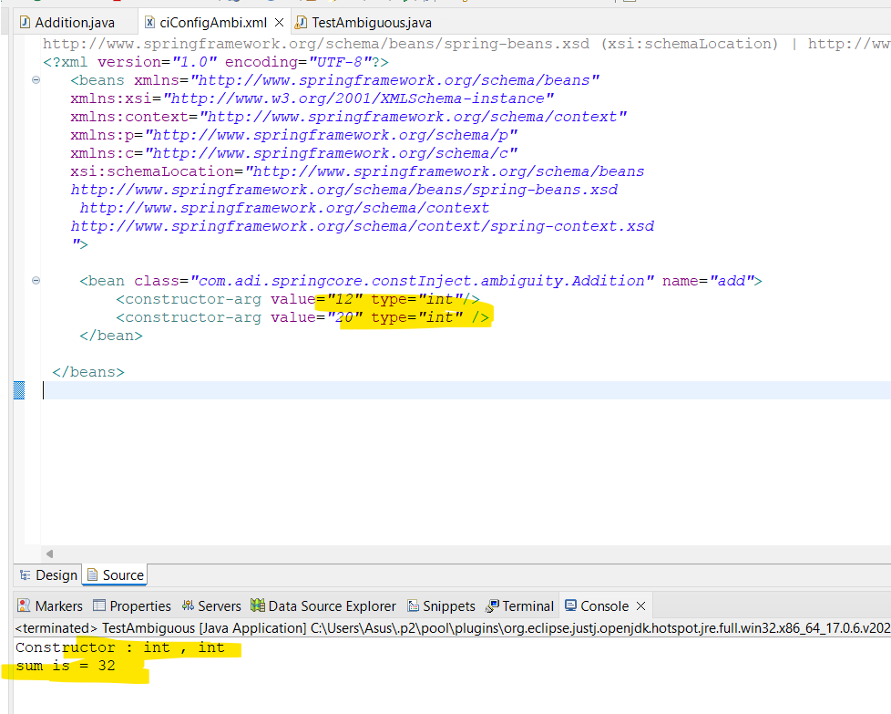
### Now focus on values
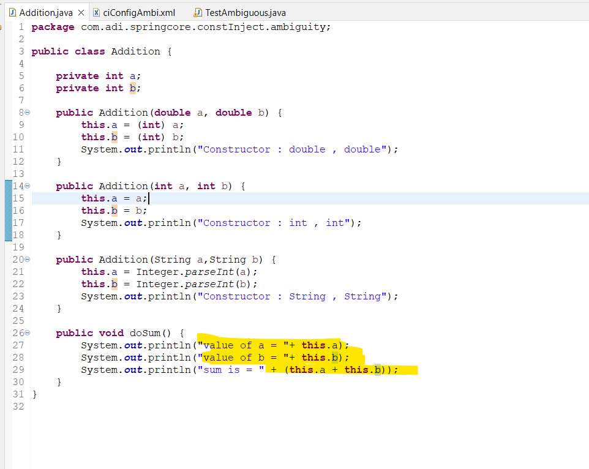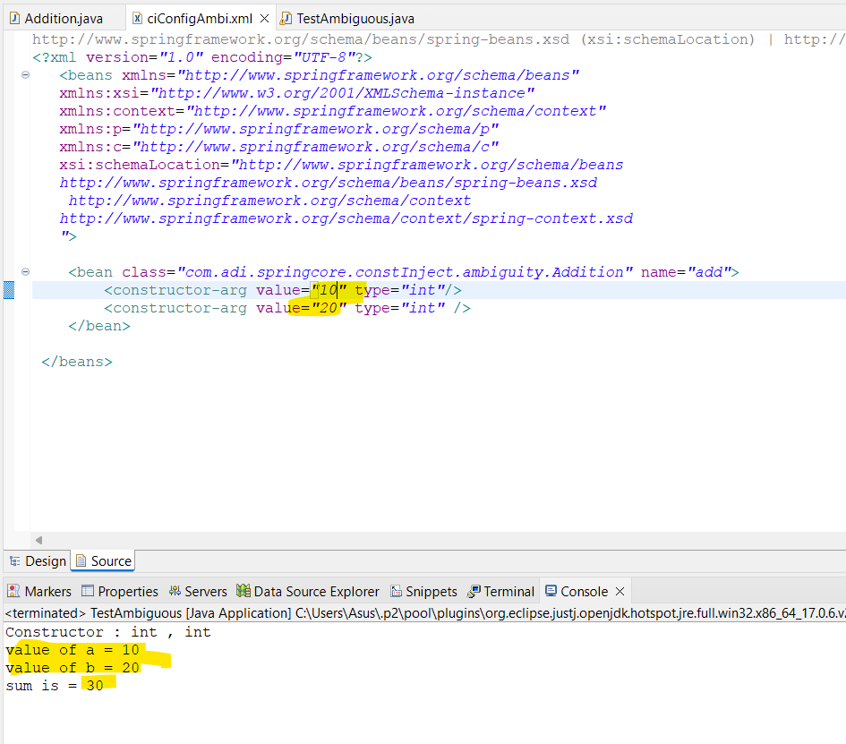
### Hum value ko interchange kar sakte via index concept
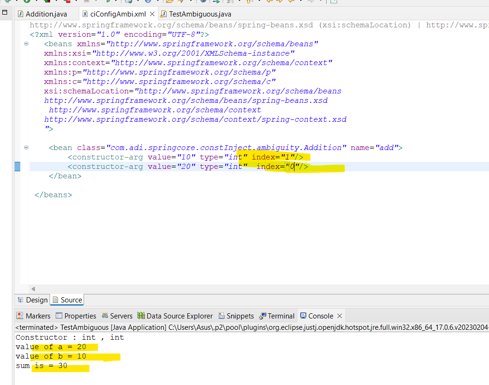
### so constructor injection mein jo ambiguity aati hai
- wo aap type,index aur order se sort out kar sakte ho.
```java
package com.adi.springcore.constInject.ambiguity;

public class Addition {

	private int a;
	private int b;

	public Addition(double a, double b) {
		this.a = (int) a;
		this.b = (int) b;
		System.out.println("Constructor : double , double");
	}

	public Addition(int a, int b) {
		this.a = a;
		this.b = b;
		System.out.println("Constructor : int , int");
	}

	public Addition(String a,String b) {
		this.a = Integer.parseInt(a);
		this.b = Integer.parseInt(b);
		System.out.println("Constructor : String , String");
	}
	
	public void doSum() {
		System.out.println("value of a = "+ this.a);
		System.out.println("value of b = "+ this.b);
		System.out.println("sum is = " + (this.a + this.b));
	}
}
```
```xml
<?xml version="1.0" encoding="UTF-8"?>     
   <beans xmlns="http://www.springframework.org/schema/beans"     
   xmlns:xsi="http://www.w3.org/2001/XMLSchema-instance" 
   xmlns:context="http://www.springframework.org/schema/context"
   xmlns:p="http://www.springframework.org/schema/p" 
   xmlns:c="http://www.springframework.org/schema/c" 
   xsi:schemaLocation="http://www.springframework.org/schema/beans 
   http://www.springframework.org/schema/beans/spring-beans.xsd
    http://www.springframework.org/schema/context 
   http://www.springframework.org/schema/context/spring-context.xsd
   ">
   
  	<bean class="com.adi.springcore.constInject.ambiguity.Addition" name="add">
  		<constructor-arg value="10" type="int" index="1"/>
  		<constructor-arg value="20" type="int"  index="0"/>
  	</bean>
	
 </beans>
```
# 13. Life cycle method of Spring Bean
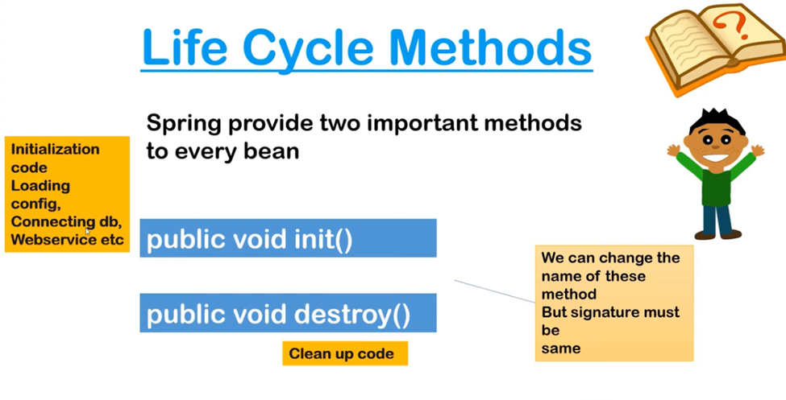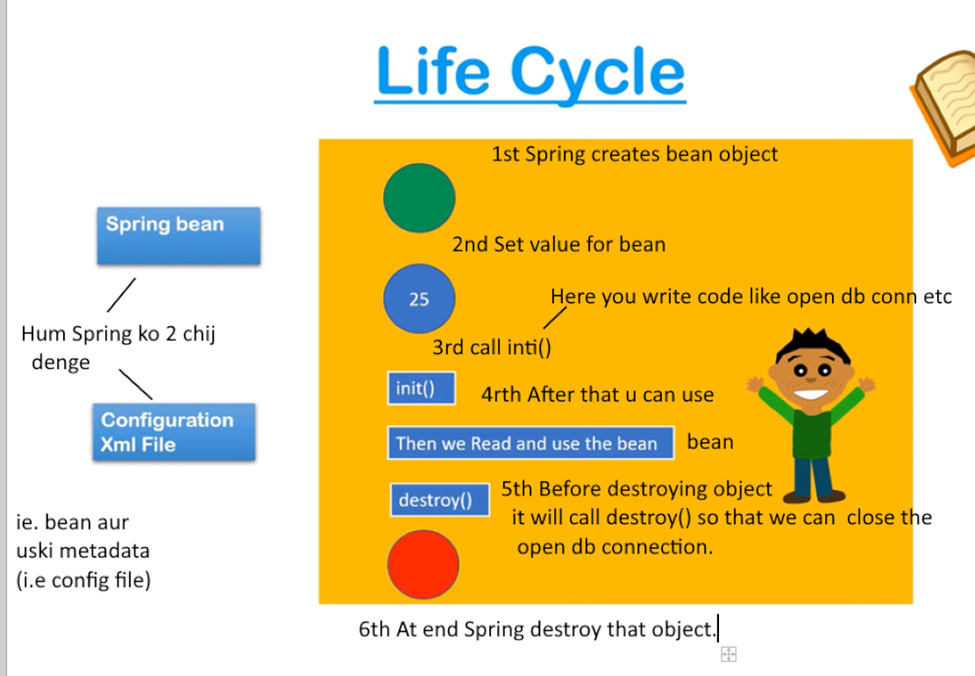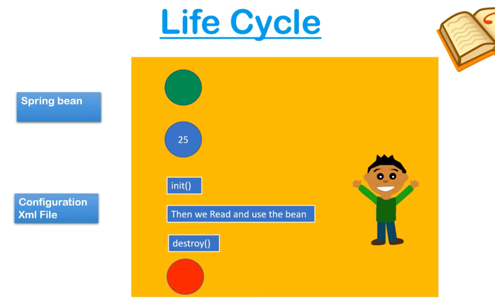
### About life cycle of  Servlet and Spring 
- Servlet ki life cycle mein init(),service() and destroy() aise 3 method hoti hai
- Spring mein lagbagh same type ki method hoti hai.
### Fhir Spring aur Servlet ki life cycle mein differnece kya hai
- Spring ki life cycle mein initialization ie. init() method ye object create karke uski property set karne ke baad call hoti hai.
- On the contrary servlet mein sabse pehle uski init() method call hoti hai.
### Explore it
- jab getBean() call karte tab spring ye tamjham suru karta.
- kyuki usko bean aur setting sari info mil jati hai.
# 14. Implementing life cycle method using xml


    

